<PageDescription>

Tooltips display additional information upon click, hover, or focus. The
information should be contextual, useful, and nonessential.

</PageDescription>

<AnchorLinks>

<AnchorLink>Overview</AnchorLink>
<AnchorLink>Live demo</AnchorLink>
<AnchorLink>Formatting</AnchorLink>
<AnchorLink>Content</AnchorLink>
<AnchorLink>Universal behaviors</AnchorLink>
<AnchorLink>Icon tooltip</AnchorLink>
<AnchorLink>Definition tooltip</AnchorLink>
<AnchorLink>Related</AnchorLink>
<AnchorLink>References</AnchorLink>
<AnchorLink>Feedback</AnchorLink>

</AnchorLinks>

## Overview

A tooltip is a message box that is displayed when a user hovers over, clicks or
gives focus to a UI element such as an icon, a highlighted word, or a button.
Tooltips should be used sparingly and contain succinct, supplementary
information.

<Row>
<Column colLg={8}>

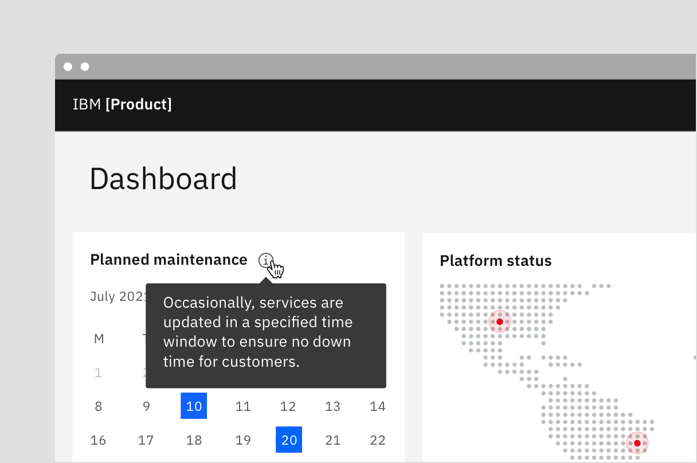

</Column>
</Row>

<Caption>Example of when to use icon tooltip</Caption>

## When to use

- Describe icon buttons
- When more information is useful in helping a user make decisions
- When a label or term might need more context or definition

<Row>
<Column colLg={12}>

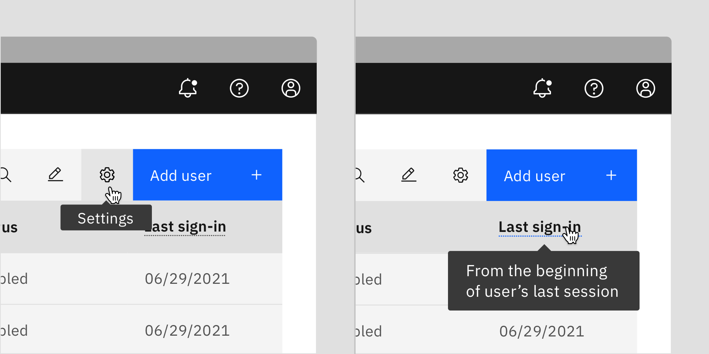

</Column>
</Row>

<Caption>
  Examples of icon tooltips (left) and definition tooltips (right)
</Caption>

## When not to use

- Since a tooltip disappears when a user hovers away, do include information
  that is pertinent for the user to complete their task. Use helper text that is
  always visible and accessible for vital information such as required fields.
- Do not include interactive elements within a tooltip. This is inaccessible.
  Use disclosure pattern or popover component when you need to include links,
  buttons, or rich media.

<DoDontRow>
  <DoDont caption="Do use helper text for pertinent information.">

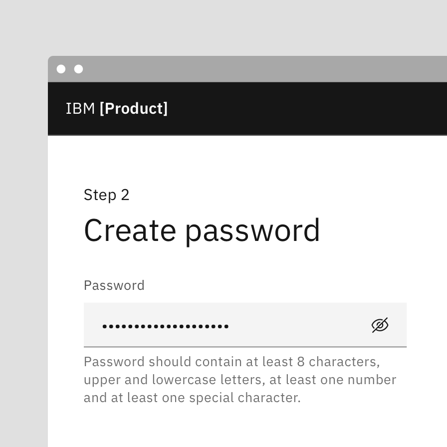

  </DoDont>
  <DoDont type="dont" caption="Do not use tooltips for pertinent information.">

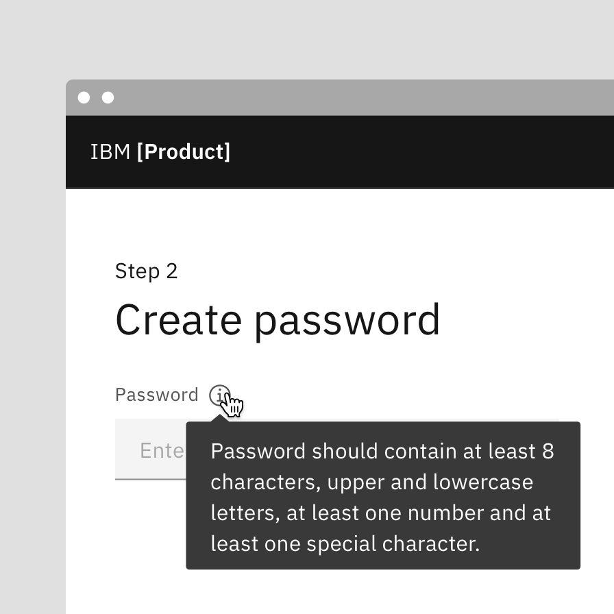

  </DoDont>
</DoDontRow>

## Types

| Name         | Purpose                                                                                                                                                                                                       |
| ------------ | ------------------------------------------------------------------------------------------------------------------------------------------------------------------------------------------------------------- |
| _Icon_       | Used to clarify the action or name of an interactive icon button or to host secondary information                                                                                                             |
| _Definition_ | Provides inline additional help or defines a term. It may be used on the label of a UI element, on a word embedded in a paragraph, or in compact spaces such as data tables where icons might clutter the UI. |

<Row>
<Column colLg={8}>

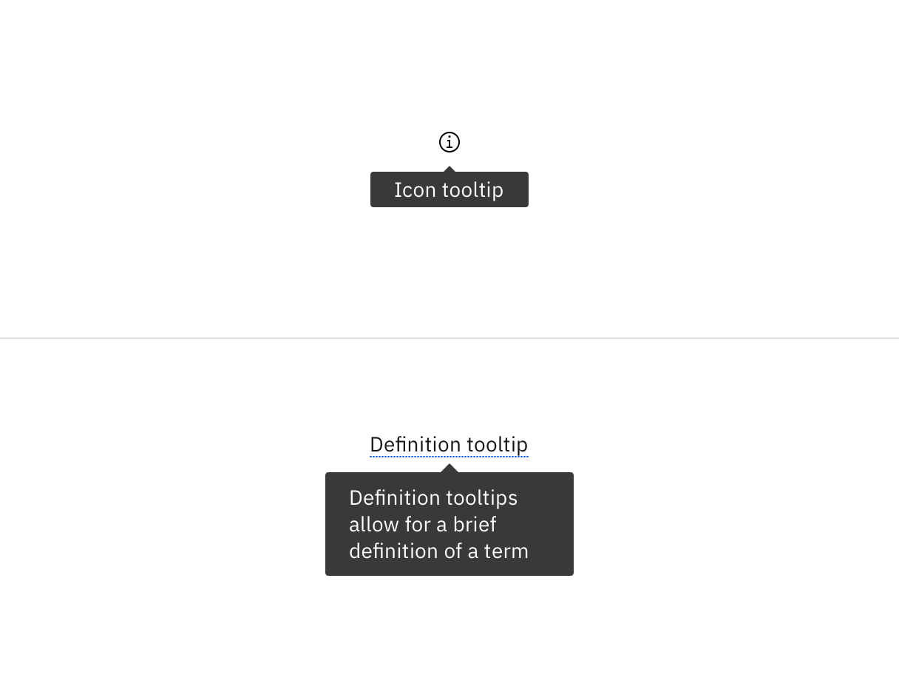

</Column>
</Row>

<Caption>
  Examples of icon tool tip (top) and definition tooltip (bottom)
</Caption>

## Live demo

import { Filter16 } from '@carbon/icons-react';

<ComponentDemo
  components={[
    {
      id: 'tooltip',
      label: 'Tooltip',
    },
    {
      id: 'icon-tooltip',
      label: 'Icon tooltip',
    },
    {
      id: 'definition-tooltip',
      label: 'Definition tooltip',
    },
  ]}
  scope={{ Filter16 }}>
  <ComponentVariant
    id="tooltip"
    links={{
      React:
        'https://react.carbondesignsystem.com/?path=/story/components-tooltip--default-bottom',
      Angular:
        'https://angular.carbondesignsystem.com/?path=/story/components-tooltip--basic',
      Vue:
        'http://vue.carbondesignsystem.com/?path=/story/components-cvtooltip--default-interactive-tootlip',
      Vanilla: 'https://the-carbon-components.netlify.com/?nav=tooltip',
    }}>{`
    <Tooltip
      direction="bottom"
      tabIndex={0}
      triggerText="Tooltip label"
    >
      

        This is some tooltip text. This box shows the maximum amount of text that should be displayed inside. If more room is needed, use a modal instead.
      

      

        <Link href="#">Learn more</Link>
        <Button size="small">
          Create
        </Button>
      

    </Tooltip>
  `}</ComponentVariant>
  <ComponentVariant
    id="icon-tooltip"
    knobs={{
      TooltipIcon: ['direction', 'align'],
    }}
    links={{
      React:
        'https://react.carbondesignsystem.com/?path=/story/components-tooltipicon--default',
      Angular:
        'https://angular.carbondesignsystem.com/?path=/story/components-tooltip-icon--basic',
      Vue:
        'http://vue.carbondesignsystem.com/?path=/story/components-cvtooltip--default-tootlip',
      Vanilla: 'https://the-carbon-components.netlify.com/?nav=tooltip',
    }}>{`
    <TooltipIcon
      tooltipText="Filter"
    >
      <Filter16/>
    </TooltipIcon>
  `}</ComponentVariant>
  <ComponentVariant
    id="definition-tooltip"
    knobs={{
      TooltipDefinition: ['direction', 'align'],
    }}
    links={{
      React:
        'https://react.carbondesignsystem.com/?path=/story/components-tooltipdefinition--default',
      Angular:
        'https://angular.carbondesignsystem.com/?path=/story/components-tooltip-definition--basic',
      Vue:
        'http://vue.carbondesignsystem.com/?path=/story/components-cvtooltip--default-definition-tootlip',
      Vanilla: 'https://the-carbon-components.netlify.com/?nav=tooltip',
    }}>{`
    <TooltipDefinition
      tooltipText="Brief description of the dotted, underlined word above."
    >
      Definition Tooltip
    </TooltipDefinition>
  `}</ComponentVariant>
</ComponentDemo>

## Formatting

### Icon tooltip anatomy

<Row>
<Column colLg={8}>

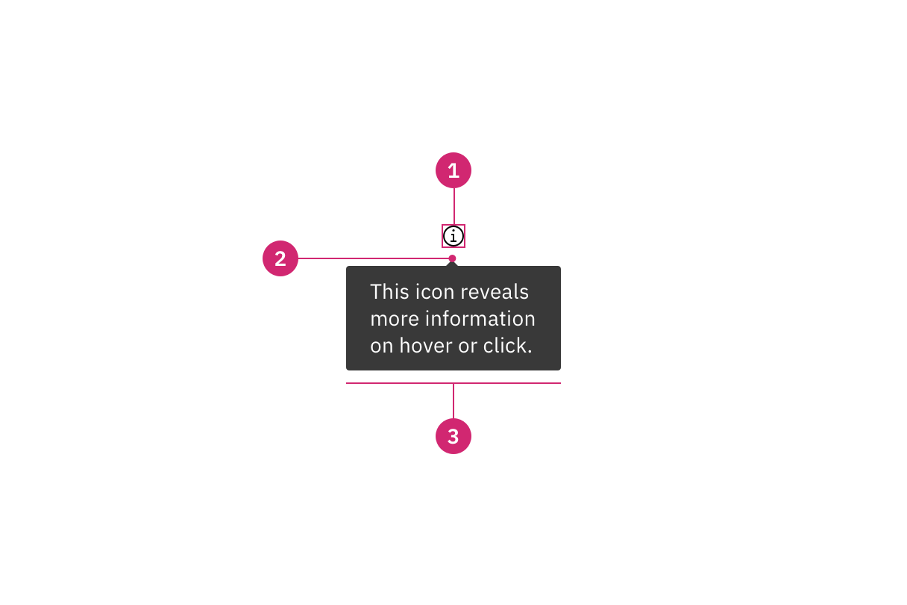

</Column>
</Row>

1. **UI trigger**: Element that triggers a tooltip when hovered over or focused
   on
2. **Caret tip**: Closely associates container and text to specific element
3. **Container**: Contains helper text

### Definition tooltip anatomy

<Row>
<Column colLg={8}>

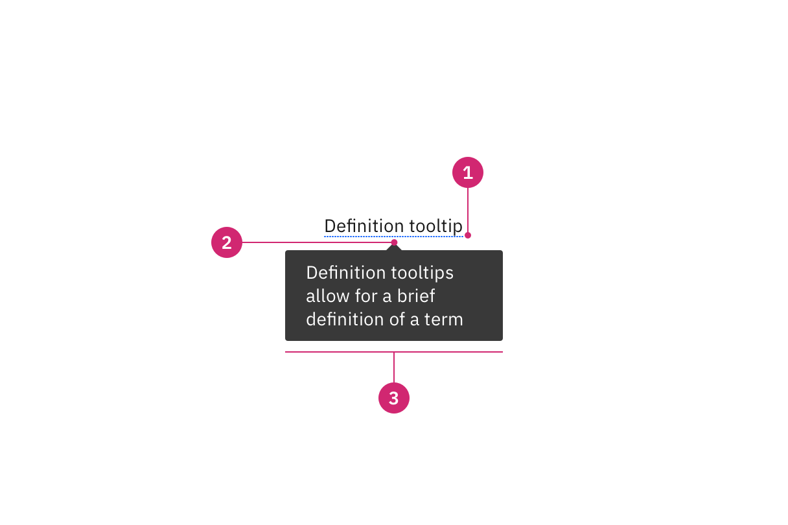

</Column>
</Row>

1. **Definition indicator**: Underline below text that cues
2. **Caret tip**: Closely associates container and text to specific element
3. **Container**: Contains helper text

## Alignment

The container of the tooltip text may be aligned
to **start**, **center** or **end** to keep the container from bleeding off the
page or covering important information. Align the caret tip to the icon or label
to clearly associate the tooltip and the UI trigger. This is especially helpful
when multiple elements are close to each other.

<Row>
<Column colLg={8}>

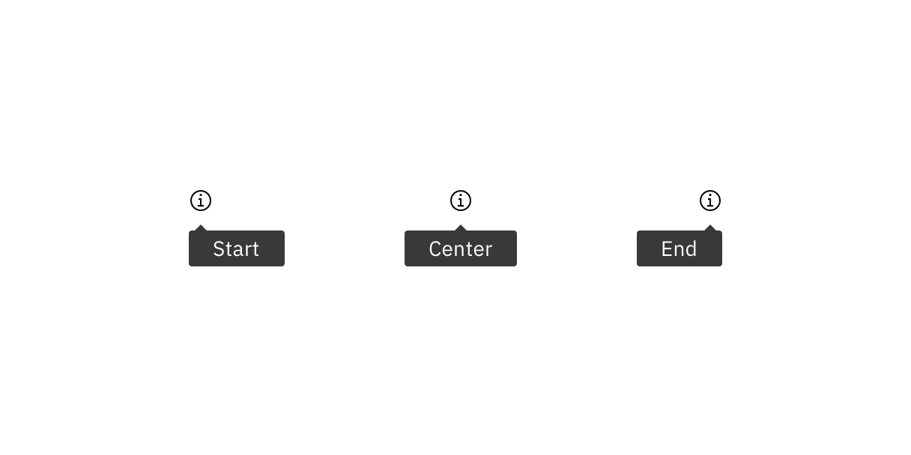

</Column>
</Row>

<Caption>Tooltip text may be aligned to start, center or end</Caption>

## Placement

Be mindful of where tooltips are positioned. Do not cover related content that
is essential to the user's tasks. Icon tooltips may be
positioned **top**, **right**, **bottom**, or **left** to the trigger item.
Definition tooltips allow for top and bottom placement. Left and right
positioning is not available for definition tooltip to ensure the tooltip does
not obstruct important information to the left or right of the trigger word.
Tooltips should not bleed off page or behind other content.

<Row>
<Column colLg={8}>

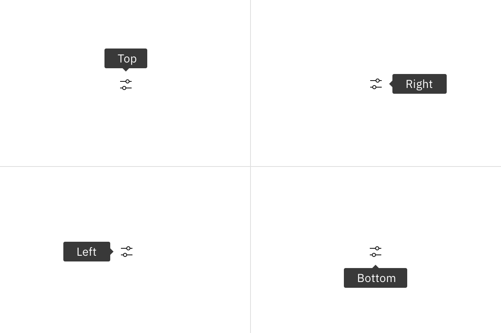

</Column>
</Row>

<Caption>
  Icon tooltips may be positioned top, right, bottom, or left to the trigger
  item
</Caption>

## Content

### Main elements

#### Labels (Definition tooltips)

- Should only be one or two words. Do not use definition tooltips on sentences.

#### Text

- Should contain relevant, specific content
- Keep tooltips short and concise, no longer than a sentence or two
- Should not contain required information essential for a user to complete their
  task since a tooltip is not persistent
- Use sentence-style capitalization and write the text as full sentences with
  punctuation, unless space is limited.

## Further guidance

For further content guidance, see Carbon’s
[content guidelines](https://carbondesignsystem.com/guidelines/content/overview/).

## Universal behaviors

The behaviors listed in this section are universal across all of the variants.
For behaviors that are unique to each variant, see the sections below.

## States

The tooltip component has two states: active and inactive. By default, the
tooltip is hidden and inactive. Tooltips are displayed on `hover` and `focus`.

### Interactions

#### Mouse

Tooltips are triggered when the mouse hovers over or clicks the active element.
The tooltip persists as long as the mouse remains over the active container or
the UI element. The tooltip is dismissed by hovering or clicking away from the
container or active element.

#### Keyboard

Users can trigger a tooltip by pressing `enter` when the UI element has focus.
To dismiss the tooltip, ...

#### Screen Readers

VoiceOver:

JAWS:

NVDA:

## Icon tooltip

An icon tooltip is used to clarify the action or name of an interactive icon
button or to provide more information. [when to use system generated (title) vs
tooltip]

### Best practices

- Icon button tooltips content should only contain one or two words.
- In more information tooltips, such as using an information icon, content
  should be precise and related

<Row>
<Column colLg={8}>

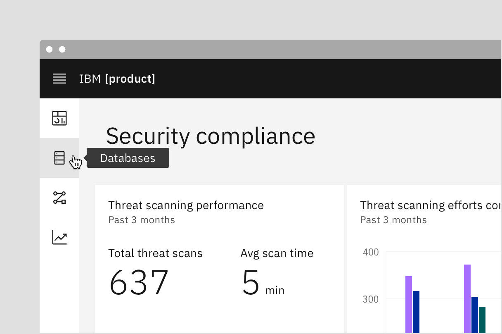

</Column>
</Row>

## Definition tooltip

The definition tooltip provides inline additional help or defines a term. It may
be used on the label of a UI element, on a word embedded in a paragraph, or in
compact spaces such as data tables where icons clutter the UI. You can use
definition tooltips on headers, body copy, or labels.

### Best practices

- Should contain brief, read-only text
- Use on proper nouns, technical terms, or acronyms with two letters or more
- Do not use a definition tooltip on words with fewer than two letters

<Row>
<Column colLg={8}>

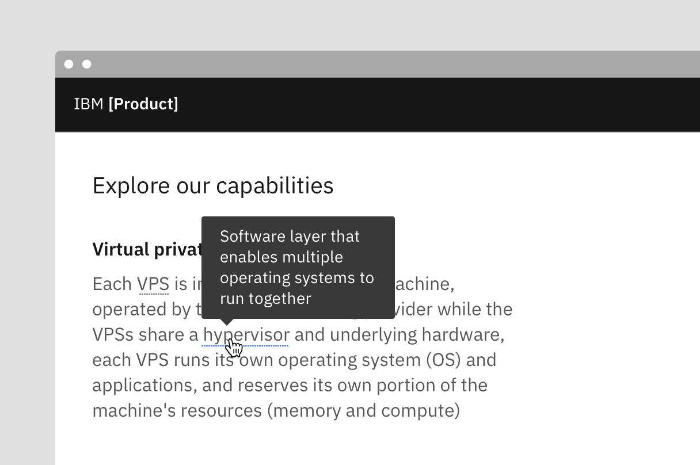

</Column>
</Row>

## Related

#### Disclosure

#### Chart tooltip

Chart tooltips appears when a cursor is positioned over an element, such as a
data point, icon button, or truncated text. These are inherent behaviors built
into our chart components. Refer to
[Chart anatomy](https://carbondesignsystem.com/data-visualization/chart-anatomy/)
to learn more about using tooltips in charts.

## References

Alita Joyce,
[Tooltip Guidelines](https://www.nngroup.com/articles/tooltip-guidelines/)
(Nielsen Norman Group, 2019)

## Feedback

Help us improve this component by providing feedback, asking questions, and
leaving any other comments on
[GitHub](https://github.com/carbon-design-system/carbon-website/issues/new?assignees=&labels=feedback&template=feedback.md).
